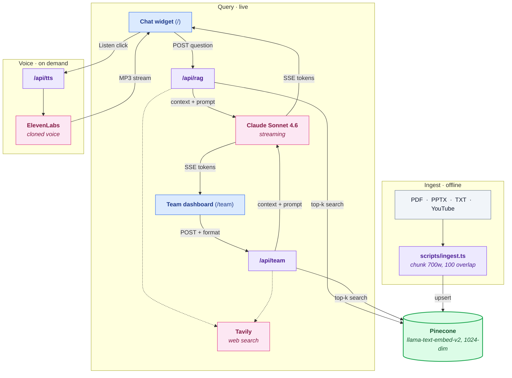

# Ask Amit — a digital twin for Dr. Amit Kapoor

A RAG-powered "expert twin" of Dr. Amit Kapoor: economist, Chairman of the Institute for Competitiveness, and Stanford lecturer. Visitors ask questions and get answers in Amit's first-person voice, grounded in his books, essays, and talks. A cloned ElevenLabs voice reads answers aloud. A separate team dashboard turns the same knowledge base into articles, critiques, analyses, infographics, slides, charts, social posts, and speech notes.

Built as a reusable skeleton: swap the source material, the prompts, and the voice, and you have a digital twin for any expert.

**Stack:** Next.js 14 · Anthropic Claude Sonnet 4.6 · Pinecone (integrated inference) · ElevenLabs · Tavily (optional web search) · Vercel.

## The two surfaces

| | Public chat widget (`/`) | Team dashboard (`/team`) |
|---|---|---|
| For | Site visitors | Amit's researchers and writers |
| Access | `ALLOWED_EMAILS`, 30 questions/day | `ADMIN_EMAILS` only, unlimited |
| Output | Short, personal, first-person answers that point to Amit's works | Long-form: chat, article, critique, analysis, infographic, slides, chart, social, speech |
| Extras | Voice playback ("Listen") | Retrieval-confidence badge, HTML preview + download, web search on contemporary topics |

Both are driven by editable markdown prompts in `prompts/` — change the voice or the rules without touching code.

## Architecture



See `ARCHITECTURE.md` for the detailed end-to-end breakdown.

## Setup from zero

### 1. Accounts you need

| Service | Used for | Rough cost |
|---|---|---|
| [Anthropic](https://console.anthropic.com/) | Answers (Claude) | Pay per token; a few dollars covers heavy testing |
| [Pinecone](https://app.pinecone.io/) | Vector search | Free tier is enough for hundreds of chunks |
| [ElevenLabs](https://elevenlabs.io/) | Cloned voice playback | Starter plan for voice cloning |
| [Tavily](https://app.tavily.com/) | Web search (optional) | Free tier: 1,000 queries/month |
| [Vercel](https://vercel.com/) | Hosting | Free Hobby tier works |

### 2. Install

```bash
git clone https://github.com/MuizzJ/amit-kapoor-digital-twin.git
cd amit-kapoor-digital-twin
npm install
```

### 3. Configure

```bash
cp .env.example .env.local
# fill in your keys, index name, voice ID, and the two email lists
```

### 4. Create the Pinecone index

In the Pinecone console, create a **serverless** index:
- Name: matches `PINECONE_INDEX_NAME` in `.env.local` (default: `ask-amit`)
- Dimensions: **1024**, metric: cosine
- Embedding model: **llama-text-embed-v2** (integrated inference)

### 5. Add source material

Drop files into `data/` (gitignored, so the expert's content stays local):
- PDFs, PPTX, or TXT files
- For TXT essays, add a header line: `Published in <venue> on <date>`

### 6. Register each source

- `scripts/ingest.ts` → add an entry to `TITLE_MAP` (display title + venue + date)
- `prompts/ask-amit.md` and `prompts/team-amit.md` → add a bullet under the sources list

### 7. Ingest

```bash
npx tsx scripts/ingest.ts "My_Book.pdf"   # one file
npx tsx scripts/ingest.ts                 # everything in data/
```

### 8. Run

```bash
npm run dev
# http://localhost:3000        → public chat widget
# http://localhost:3000/team   → team dashboard (admin email required)
```

## Deploy to Vercel

1. Push the repo to GitHub and import it at [vercel.com/new](https://vercel.com/new).
2. Add every variable from `.env.local` in Project → Settings → Environment Variables (paste values without trailing newlines; add each to Production).
3. Deploy. The email gate is live immediately: only `ALLOWED_EMAILS` / `ADMIN_EMAILS` can use the endpoints, and per-user rate limits cap spend.

Whoever owns the Vercel project pays the API bills, since the keys live in its env vars. To hand the running system to someone else, they deploy their own copy with their own keys, and you delete or rotate yours.

## Access control and limits

- `ADMIN_EMAILS`: unlimited use of both surfaces, including `/team`.
- `ALLOWED_EMAILS`: public widget only, 30 questions and 30 listens per day each, with a global daily cap as a backstop.
- Everyone else gets a polite lockout. All requests are logged as structured JSON (visible in Vercel logs).

## Editing the twin's voice

The system prompts are markdown files, live-reloaded on every request in dev (redeploy picks them up in production):

- `prompts/ask-amit.md` — public widget. Persona, indexed sources, banned AI-writing patterns, length rules, and the "never dead-end" rule: when a question falls outside the indexed work, the twin says so in one personal line, reasons through the expert's frameworks aloud, and points to the nearest relevant work.
- `prompts/team-amit.md` — team dashboard. Same persona plus per-format output instructions.

## Workflows

### Add a YouTube video
```bash
npx tsx scripts/fetch-youtube.ts "https://www.youtube.com/watch?v=VIDEO_ID"
```
Prints a ready-to-paste `TITLE_MAP` entry, prompt bullet, and ingest command.

### Regenerate the knowledge-base cluster map
```bash
npx tsx scripts/export-clusters.ts        # ~2 min, re-labels via Claude
npx tsx scripts/generate-cluster-html.ts  # rewrites cluster.html
```

## Replicating this for your own use

This repo is a skeleton. To stand up your own twin (or take over this one), the fastest path is [Claude Code](https://claude.com/claude-code) — this entire project was built with it.

1. Complete **Setup from zero** above with your own accounts and keys.
2. Open the repo in Claude Code and describe what you want changed. Prompts that work well:
   - "Rebrand this from Amit Kapoor to [name]: landing page, prompts, widget labels."
   - "Add [new essay/book] as a source: ingest it, register it in TITLE_MAP and both prompts."
   - "Change the chat widget's tone to [X]" (it will edit `prompts/ask-amit.md`).
   - "Add a new output format to the team dashboard for [press releases]."
3. Deploy to Vercel with your own env vars.

### Using this with a Wix site

Wix cannot host a Next.js app, so keep this project on Vercel and connect the two:

- **Link out** (simplest): keep the Vercel URL as the destination for an "Ask me anything" button on the Wix site, optionally on a custom subdomain like `ask.yourdomain.com` (add the subdomain in Vercel → Domains, then a CNAME in your DNS).
- **Embed**: add a Wix *Embed → Custom Element / iframe* block pointing at the Vercel URL, so the chat appears inside a Wix page.
- Content updates never touch Wix: add sources and re-ingest here, redeploy, and the embedded/linked experience updates everywhere.

## Housing the source library on Umbrel (optional)

Pinecone stores only embeddings. The raw books, essays, and transcripts live in `data/` on whichever machine runs ingestion, and `data/` is gitignored, so the corpus needs a permanent home. If you run an [Umbrel](https://umbrel.com/) home server, make it the system of record:

1. On Umbrel, install a file-sync app from the App Store. **Nextcloud** (folder you can browse and share) or **Syncthing** (silent two-way sync) both work.
2. Create a folder on Umbrel, for example `amit-twin/corpus`, and upload every source file: book PDFs, essay TXTs, slide PPTXs, YouTube transcript files.
3. On the laptop that runs ingestion, connect the sync client to that folder and point it at (or copy into) the repo's `data/` directory.
4. Ingest as usual: `npx tsx scripts/ingest.ts`. Pinecone gets the embeddings, Umbrel keeps the originals.
5. Also sync the generated artifacts worth keeping: `clusters-data.json` and `cluster.html` after a cluster regen.
6. When new material is added later, drop it into the Umbrel folder first, let it sync down, then run the ingest step. That way the Umbrel copy is always the complete library, and any machine can rebuild the Pinecone index from it.

Umbrel here is the canonical library plus backup. Pinecone, Anthropic, and ElevenLabs remain cloud services; if you ever need to rebuild from scratch, everything required is the repo plus the Umbrel folder plus your API keys.

## Project layout

```
app/
  api/
    rag/route.ts     public streaming RAG endpoint (Pinecone + Claude + optional Tavily)
    team/route.ts    team endpoint: formats, web search, confidence score
    tts/route.ts     ElevenLabs voice synthesis stream
  page.tsx           landing page
  team/page.tsx      team dashboard UI
components/
  VoiceWidget.tsx    chat widget (streaming, source pills, Listen button)
lib/
  ratelimit.ts       email allowlist + per-user/global rate limits
scripts/
  ingest.ts             chunk + embed + upsert pipeline
  fetch-youtube.ts      transcript + metadata scraper
  export-clusters.ts    UMAP + k-means + Claude labels → clusters-data.json
  generate-cluster-html.ts   inlines data into cluster.html
prompts/
  ask-amit.md        public widget system prompt (live-reloaded)
  team-amit.md       team dashboard system prompt (live-reloaded)
data/                source material (gitignored)
```

## Roadmap

- [ ] MCP wrapper (`ask-amit-mcp`) so the twin can be called from Claude Code / Claude Desktop
- [ ] Voice input (mic button → Web Speech API or Whisper)
- [ ] Phase 3: Twilio telephony (Whisper STT → RAG → ElevenLabs TTS)

## License and content

Code: MIT-style, use it as a skeleton for your own twin. Source material in `data/` is the intellectual property of Dr. Amit Kapoor and his publishers and is never committed to this repo. The cloned voice may only be used with Dr. Kapoor's consent.
