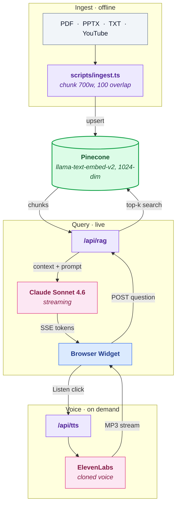

# Ask Amit

A digital-twin RAG chatbot for Dr. Amit Kapoor — economist, Chairman of the Institute for Competitiveness, and Stanford lecturer. Built as a Phase 1 MVP: visitors ask questions, the system retrieves from Amit's published work, and Claude answers in his voice. An ElevenLabs-cloned voice reads the answer aloud on demand.

Stack: Next.js 14 · Anthropic Claude Sonnet 4.6 · Pinecone (integrated inference) · ElevenLabs.

## What's in the box

- **Streaming RAG chat widget** — Pinecone semantic search + Claude streaming + source pills.
- **Voice playback** — "Listen" button on every answer, cloned voice via ElevenLabs.
- **Editable system prompt** (`prompts/ask-amit.md`) — first-person rule, banned AI-isms, source list.
- **Ingestion scripts** for PDF, PPTX, TXT, and YouTube transcripts.
- **Cluster visualization** (`cluster.html`) — interactive UMAP scatter of the knowledge base colored by k-means topic clusters (Claude-labeled).
- **Summary page** (`summary.html`) — brand-styled one-pager with architecture, costs, stack.

## Architecture



See `ARCHITECTURE.md` for the detailed end-to-end breakdown.

## Setup

### 1. Prerequisites
- Node.js 18+
- Accounts: [Anthropic](https://console.anthropic.com/), [Pinecone](https://app.pinecone.io/), [ElevenLabs](https://elevenlabs.io/)

### 2. Install
```bash
git clone https://github.com/MuizzJ/amit-kapoor-digital-twin.git
cd amit-kapoor-digital-twin
npm install
```

### 3. Configure
```bash
cp .env.example .env.local
# edit .env.local with your four keys + Pinecone index name + ElevenLabs voice ID
```

### 4. Create the Pinecone index
In the Pinecone console, create a **serverless** index:
- Name: matches `PINECONE_INDEX_NAME` in `.env.local` (default: `ask-amit`)
- Dimensions: **1024**
- Metric: cosine
- Embedding model: **llama-text-embed-v2** (integrated inference)

### 5. Add source material
Drop files into `data/` (gitignored — your own content stays local):
- PDFs, PPTX, or TXT files
- For TXT essays, add a header line: `Published in <venue> on <date>`

### 6. Register each source
Edit `scripts/ingest.ts` → add an entry to `TITLE_MAP` (display title + venue + date).
Edit `prompts/ask-amit.md` → add a bullet under the sources list.

### 7. Ingest
```bash
# single file:
npx tsx scripts/ingest.ts "The_Age_of_Awakening_Final.pdf"

# or all files in data/:
npx tsx scripts/ingest.ts
```

### 8. Run
```bash
npm run dev
# open http://localhost:3000 (or :3001 if 3000 is busy)
```

## Workflows

### Add a YouTube video
```bash
npx tsx scripts/fetch-youtube.ts "https://www.youtube.com/watch?v=VIDEO_ID"
```
The helper prints a ready-to-paste `TITLE_MAP` entry + prompt bullet + ingest command.

### Regenerate the cluster map
```bash
npx tsx scripts/export-clusters.ts        # ~2 min, re-labels via Claude
npx tsx scripts/generate-cluster-html.ts  # rewrites cluster.html with fresh data
```

## Project layout

```
app/
  api/
    rag/route.ts     streaming RAG endpoint (Pinecone + Claude)
    tts/route.ts     ElevenLabs voice synthesis stream
  page.tsx           landing page
components/
  VoiceWidget.tsx    chat widget (streaming, source pills, Listen button)
scripts/
  ingest.ts             chunk + embed + upsert pipeline
  fetch-youtube.ts      transcript + metadata scraper
  export-clusters.ts    UMAP + k-means + Claude labels → clusters-data.json
  generate-cluster-html.ts   inlines data into cluster.html
prompts/
  ask-amit.md        editable system prompt, live-reloaded each request
data/                source material (gitignored)
```

## Roadmap

- [ ] Deploy to Vercel with shared-secret auth
- [ ] MCP wrapper (`ask-amit-mcp`) so Amit can call from his own Claude Code
- [ ] Voice input (mic button → Web Speech API or Whisper)
- [ ] Staff dashboard with Ask / Critique / Draft modes
- [ ] Phase 3: Twilio telephony (Whisper STT → RAG → ElevenLabs TTS)

## License

Private. Source material in `data/` is the intellectual property of Dr. Amit Kapoor and his publishers.
